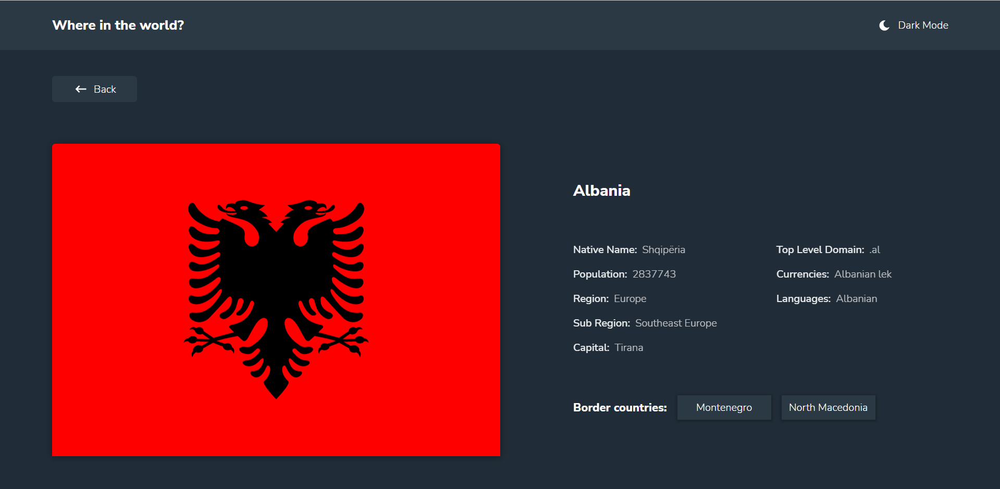

### The challenge

Users should be able to:

- [x] See all countries from the API on the homepage
- [x] Search for a country using an `input` field
- [x] Filter countries by region
- [x] Click on a country to see more detailed information on a separate page
- [x] Click through to the border countries on the detail page
- [x] Toggle the color scheme between light and dark mode *(optional)*

### Links

- Solution URL: [Solution](https://www.frontendmentor.io/solutions/rest-api-countries-RuNv_5Vbhl)
- Live Site URL: [LIVE](https://findacountrynowapi.netlify.app/)

### Built with

- HTML5 
- SCSS 
- JAVASCRIPT

### Continued development

Organizing the javascript code 

## Author

- Frontend Mentor - [Abrosss](https://www.frontendmentor.io/profile/Abrosss)
- [Twitter](https://twitter.com/ronessu)

